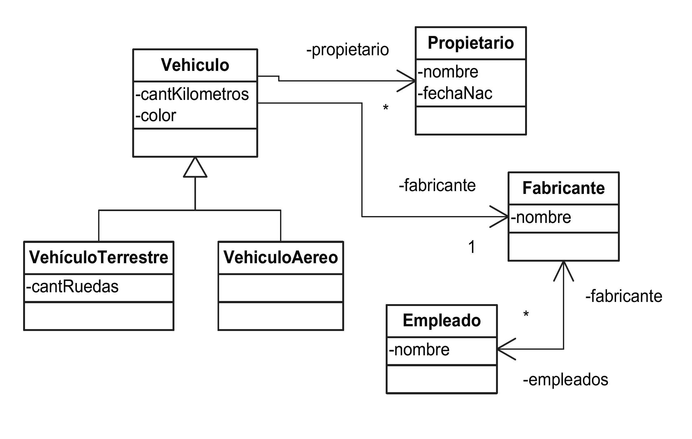
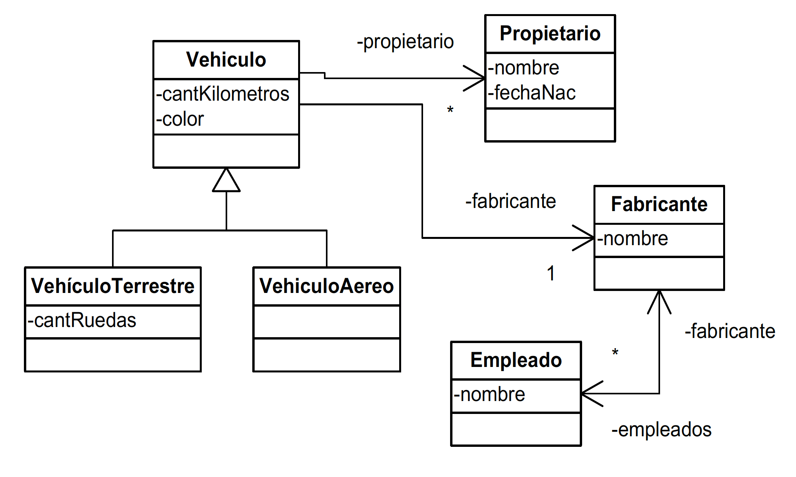

# Preguntas de final

## Mesa 09 de Junio de 2023

### 1) Explique brevemente qué es JPA y para qué fue creado.

### 2) ¿Cuáles son las reglas para persistencia de POJOs en Hibernate?

### 3) ¿Cuál es la diferencia principal entre DAO y el patrón Repository?

### 4) Defina persistencia por alcance.

### 5) Explique brevemente como es el control de concurrencia optimista basado en versiones que utiliza Hibernate.

### 6) Considerando Java Data Objects (JDO). Comente alguno de los posibles estados en los que se encuentra una instancia al ser persistida con esta tecnología.

### 7) ¿Qué significa que la persistencia debería ser ortogonal?

### 8) Dado el siguiente modelo escriba en HQL una consulta que obtenga los Vehículos aéreos con menos de 400.000 km, de propietarios nacidos en 1985 y fabricante “Airbus”.

### 9) Dado el siguiente elemento de mapeo de clases

```
<class name="VIPUser" table="tableName" discriminator-value="2"
lazy="true" abstract="false" ... />
```

Describa para qué se utiliza “discriminator-value”

### 10) Usualmente las soluciones de persistencia utilizan el patrón de diseño Proxy en su implementación. Explique cuáles son los beneficios que brinda su aplicación y en qué circunstancias se lo utiliza.

## Mesa 09 de Agosto de 2024

### 1) Defina persistencia por alcance.

### 2) ¿Qué limitaciones de las BBDD relacionales buscan superar las BBDD orientadas a documentos? Mencione al menos dos.

### 3) Mencione diferencias entre JDO y Hibernate. Compare los principales elementos presentes en cada uno de ellos.

### 4) Considerando Java Data Objects (JDO). Comente alguno de los posibles estados en los que se encuentra una instancia al ser persistida con esta tecnología.

### 5) Explique brevemente como es el control de concurrencia optimista basado en versiones que utiliza Hibernate.

### 6) ¿Para qué sirve la propiedad FetchType en Hibernate? Describa un caso de uso para cada valor que puede tomar.

### 7) Usualmente las soluciones de persistencia utilizan el patrón de diseño Proxy en su implementación. Explique cuáles son los beneficios que brinda su aplicación y en qué circunstancias se lo utiliza.

### 8) Explique el principio de ortogonalidad en ORMs.

### 9) Explique las diferencias principales entre HQL y Criteria

### 10) Dado el siguiente modelo escriba en HQL una consulta que obtenga los Vehículos aéreos de fabricante “Cessna” y propietarios nacidos antes de 1980.



## Mesa 13 de Diciembre 2024

### 1) Mencione diferencias entre Java Data Objects (JDO) y Hibernate. Compare los principales elementos presentes en cada uno de ellos.

### 2) ¿Cuáles son las reglas para persistencia de POJOs en Hibernate? Indique cuáles son obligatorias y cuáles opcionales.

### 3) Defina persistencia por alcance.

### 4) Mencione características de los DTOs y por qué son necesarios. ¿En qué casos los utilizaría?

### 5) Al mapear una jerarquía de clase, ¿Cuáles son las ventajas y desventajas de la estrategia “single table” (una tabla para toda la jerarquía)?

### 6) Explique el motivo por el cual se utiliza el patrón de diseño Proxy en soluciones de persistencia Objeto-Relacional.

### 7) Explique cómo funciona la estrategia de recuperación EAGER en Hibernate, y en qué caso la utilizaría.

### 8) Dado el siguiente modelo escriba en HQL una consulta que obtenga los Vehículos aéreos de fabricante “Cessna” y propietarios nacidos después de 1970.



### 9) ¿Qué son los principios BASE de las bases de datos NoSQL?

### 10) ¿Qué limitaciones de las BBDD relacionales buscan superar las BBDD orientadas a documentos? Mencione al menos dos.
